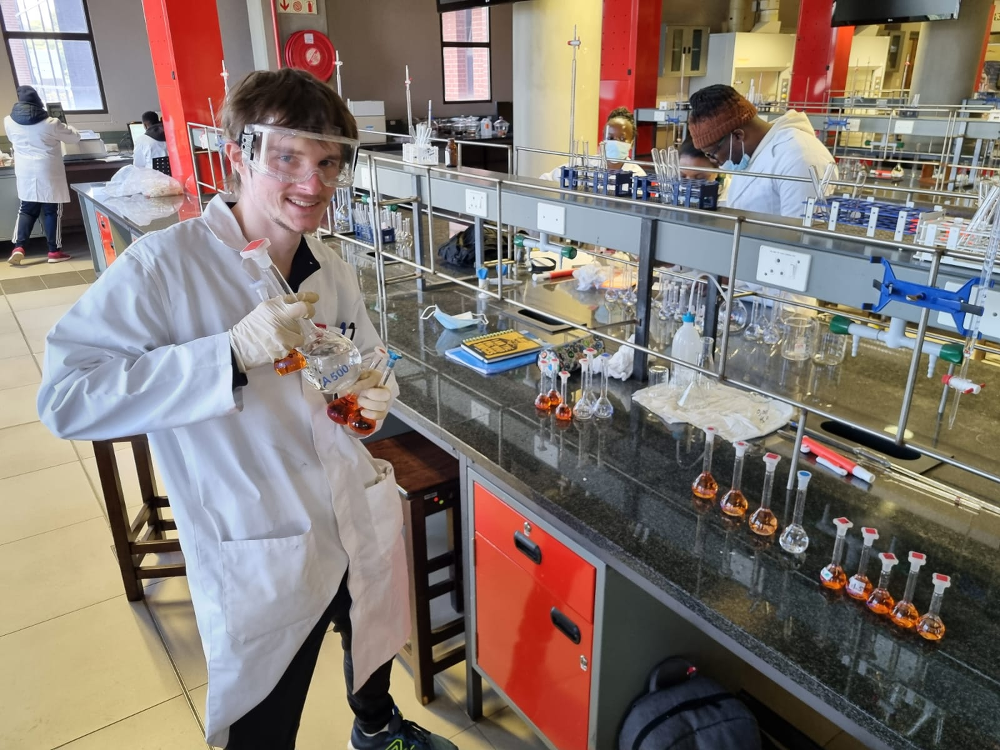

:fontawesome-solid-circle-info: About me
========

<a href="../images/lab_pic.jpg"></img></a>

My name is Vaughan, I am a BSc.
Physics and Chemistry graduate.
My passion has always been within the
field of physics, which I excelled in
during my studies. I have, however,
taken quite an interest into chemistry
as well - a field I find a lot more
approachable.
I even have my own mini chemistry lab
with professional equipment which I
conduct regular experimentation
within. Along with documenting Chemistry and Educational content for
my <a href="https://www.youtube.com/@DeltaDirtyVRK" target="_blank">YouTube channel</a> DeltaDirty, Uploading Videos related to theory and practical work of Science, or sometimes even art.

I love working in a **small team** (granted people are respectful), I find things move much faster with a cooperative effort, and **Helping others** is something I am naturally inclined to do.

**Thank you** for taking the time to read this, and hopefully it was informative at the very least.
