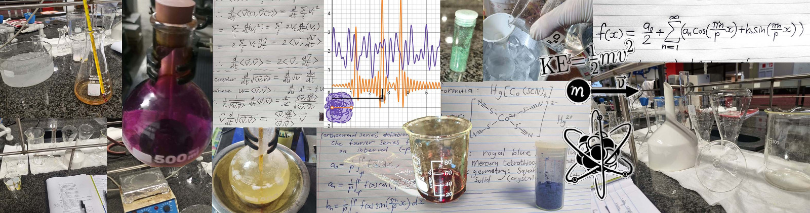

:fontawesome-solid-briefcase: Experience
==========

</img>
<!-- Why Button? =  -->

## Work/Employment
I have been a tutor of Mathematics, Physics and Chemistry (or even Python and C++ sometimes), both Employed by company and my own Private practice for +5 years, from 2020 to Present day.

<a href="/documents/Letters%20of%20Reference.pdf" target="_blank">Tutoring and Academic Letters of Referance</a>

## Education
2021 - 2024 Bachelors of science Degree, CUM LAUDE

BSc. Physics and chemistry (complete) University of South Africa (UNISA)

Relevant coursework:
Chemistry:
    THEORY:

• Organic chemistry

• Inorganic chemistry

• Analytical chemistry

• Physical chemistry

• Polymer chemistry

    APPLIED:

• TLC, NMR, IR +UV-vis spectroscopy

• Extraction of organic and inorganic compounds

• Synthesis of organic compounds, inorganic complexes, and synthetic or bio-organic polymers.

• Crystallization and recrystallization of pure elements and organic chemicals.

• Standard titrations, potentiometric titrations, Volhard back titrations.

• Metal Electroplating, construction of Galvanic or electrolytic cell.

• Distillation of SO Many Different Chemicals.

Physics:

• Electromagnetism and thermodynamic physics.

• General relativity gravity and tensor calculus*.

• Differential geometry, applied metric spaces*.

• Engineering physics and statistics.

• Ordinary and Partial differential equations* (ODE, PDE*).

• Calculus in higher dimensions.

• Linear algebra.

• Real analysis*.

• Quantum mechanics, solid state physics.

( * = Done for Enrichment, Extra above and beyond what was required. ) 