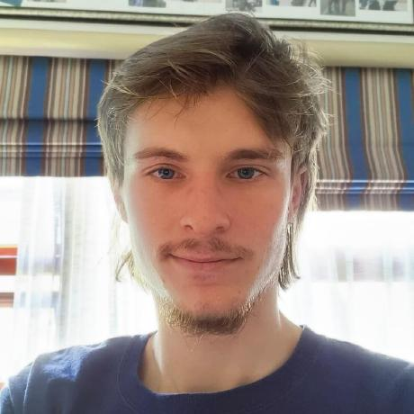

# Vaughan Royce Kildaire

## Who am I?

</img>

$$
\Gamma \left( x \right) = \int\limits_0^\infty {s^{x - 1} e^{ - s} ds}
$$

Lorem ipsum dolor sit amet, consectetur adipiscing elit. Nam nec lacus lorem. Morbi facilisis, justo id semper eleifend, eros tellus pharetra neque, sit amet cursus dolor mi eu nisi. Nam rutrum ultrices aliquam. Nullam ac aliquet tellus. Nam fermentum metus et mauris maximus bibendum. Nam condimentum blandit lacus eu euismod. Ut sodales eget velit eu egestas. Donec nec dui et purus hendrerit luctus. Vestibulum molestie ullamcorper quam, eu ultrices turpis tincidunt sed. Etiam sollicitudin dui lectus, vel iaculis nunc molestie nec. Nunc a sapien vitae tortor elementum rhoncus eget vitae nulla. Cras tincidunt libero nulla, eget dictum ligula suscipit a. Praesent blandit odio tincidunt neque bibendum, in posuere lacus efficitur.

In sit amet odio lacus. Mauris quis varius odio. Aenean sit amet eros volutpat quam hendrerit suscipit eu ac leo. Nam neque neque, elementum ut commodo sit amet, lacinia maximus arcu. Nulla scelerisque ipsum non gravida pulvinar. Aenean sit amet porttitor ligula. Donec eu nulla neque.

## :fontawesome-solid-user-graduate: Education

* UNISA: **BSC Degree in Physics and Chemistry (in progress)**
* Atlantic International University: **Degree in Animation**
* Bridge House: **Highschool**

## Skills & Experience

<u>Educator</u>: Tutoring in math, physics and chemistry.

<u>Arts</u>: 3D Animation. Minor experience in Voice acting. Instruments; guitar and bass. Painting; oil on canvas and digital (photoshop).

<u>Lab Assistant</u>: Capable lab assistant for setting up apparatus and glassware, titration, A/B extraction etc. Familiar with the general chemistry laboratory environment.

## :fontawesome-solid-briefcase: Experience

### Tutoring

I have worked as a private, as well as part time employed, tutor since
2020 and honestly If I could I would Teach at a formal institute, as I really
enjoy teaching as much as I enjoy learning.
Subjects include: University; mathematics, physics and chemistry, and
Highschool; mathematics and physical science (physics, chemistry, etc.)
This includes letters of reference from past clients.

### Lab work

I must state clearly that as of now (2022) I do not have experience from
employment. However, I Do Have Laboratory experience from practical
work in my studies, as well as working on my own chemistry projects with
my own apparatus and reagents (limited that may be).
In order to gain experience, you need employment, but in order to get
employment you need experience. Although I am confident that my
ability speaks for itself.

## :fontawesome-solid-flask-vial: Skills

### Lab hand

Capable lab assistant for setting up apparatus and glassware, titration,
A/B extraction, solvent separation, filtration via pump or gravity and
preparing solutions of required concentration.

Cleaning glassware and preparation of strong cleaning agent (e.g.,
piranha solution) if need be.

<!-- TODO: "Spiles"? Not spills? SPELL CHECK EVERYTHING -->
General knowledge of lab safety, equipment and reagents used in spiles
or emergencies.

General knowledge of common apparatus and glassware usage.
I own a small-scale personal lab, and along with my formal lab training
from practical work, I am familiar with the general chemistry laboratory
environment.

### Tutoring

* Tutoring in math physics and chemistry.
* Private in person and through employer (Teach me 2) online.

### Arts

* Guitar, bass, and both oil and digital painting.
* 3D Animation. Voice acting.

---

## Projects

1. [Chemistry project: Soap]()

